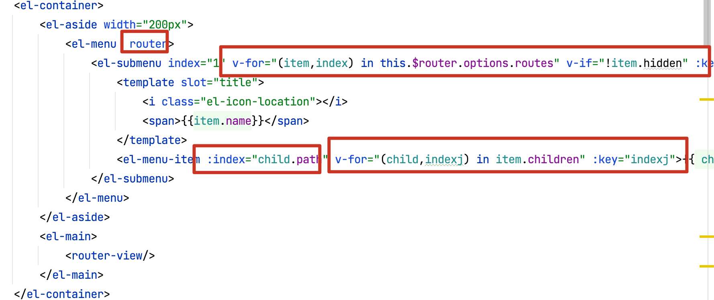
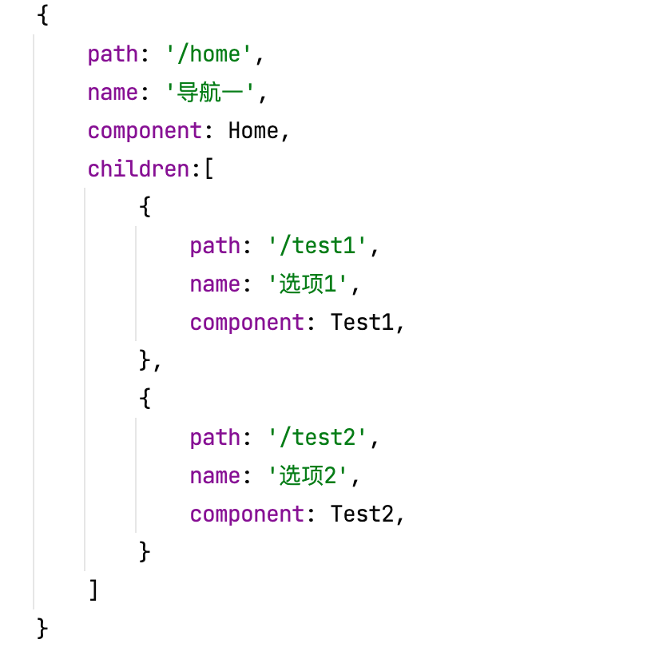
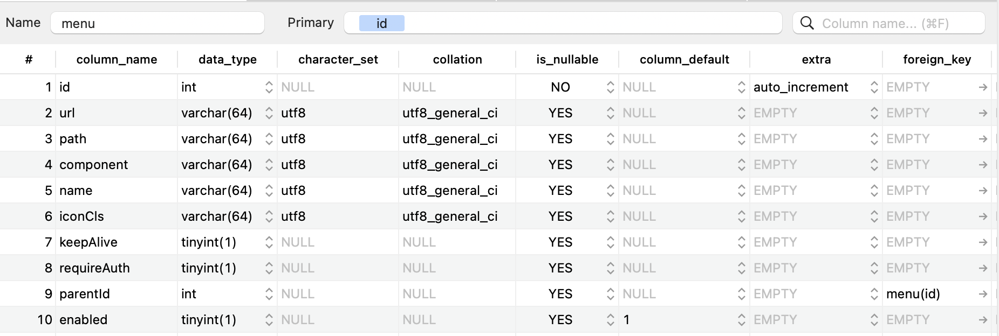
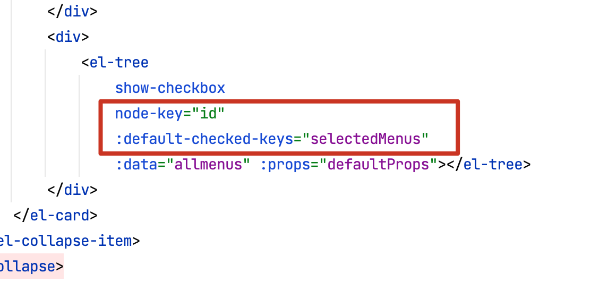

# vuehr

## Project setup
```
npm install
```

### Compiles and hot-reloads for development

```
npm run serve
```

### Compiles and minifies for production
```
npm run build
```

### Customize configuration
See [Configuration Reference](https://cli.vuejs.org/config/).


# day 1

## 登陆界面

```vue
<template>
    <div>
        <el-form :rules="rules"  ref="loginForm" :model="loginForm" class="loginContainer">
            <h3 class="loginTitle">系统登陆</h3>
            <el-form-item prop="username">
                <el-input type="text" v-model="loginForm.username" auto-complete="off" placeholder="请输入用户名"></el-input>
            </el-form-item>
            <el-form-item prop="password">
                <el-input type="text" v-model="loginForm.password" auto-complete="off" placeholder="请输入用户密码"></el-input>
            </el-form-item>
            <el-checkbox class="loginRemember" v-model="checked">记住我</el-checkbox>
            <el-button type="primary" style="width: 100%" @click="submitLogin('loginForm')">登陆</el-button>
        </el-form>
    </div>
</template>

<script>
export default {
    name: 'Login',
    data () {
        return {
            loginForm: {
                username: 'admin',
                password: '123',
            },
            checked: true,
            rules: {
                username: [{ required: true, message: '请输入用户名', trigger: 'blur' }],
                password: [{ required: true, message: '请输入密码', trigger: 'blur' }],
            },
        }
    },
    methods: {
        submitLogin (formName) {
            this.$refs[formName].validate((valid) => {
                if (valid) {
                    alert('submit!')
                } else {
                   this.$message.error('请输入所有字段')
                }
            })
        },
    },
}
</script>

<style>
.loginContainer {
    border-radius: 15px;
    background-clip: padding-box;
    margin: 180px auto;
    width: 350px;
    padding: 15px 35px 15px 35px;
    background: #fff;
    border: 1px solid #eaeaea;
    /*阴影*/
    box-shadow: 0 0 25px #cac;
}

.loginTitle {
    margin: 20px auto 40px auto;
    text-align: center;
    color: #ccaacc;
}

.loginRemember {
    text-align: left;
    margin: 0px 0px 15px 0px;
}

</style>
```


# day2

## 安装axios

```
npm install axios  
```


## 封装api.js(响应)

```js
import axios from 'axios'
// 引入 Message
import { Message } from 'element-ui';

axios.interceptors.response.use(success=>{
    if(success.status && success.status==200 && success.data.status==500){
        Message.error({message:success.data.msg})
        return;
    }
    return success.data;
},error => {
    if (error.response.status==504||error.response==404) {
        Message.error({message:'服务器被吃了'})
    }else if (error.response.status==403||error.response==404) {
        Message.error({message:'权限不足，请联系管理员'})
    }else if (error.response.status==401){
        Message.error("尚未登陆，请登录");

    }else {
        if(error.response.data.msg){
            Message.error({message:error.response.data.msg});
        }else {
            Message.error({message:"未知错误"})
        }
    }

    return;

})
```


# day 3

## 封装api.js(请求)

```
var base = '';

export const postKeyValueRequest = (url, params) => {
    return axios({
        method: 'post',
        url: `${base}${url}`,
        data: params,
        transformRequest: [function (data) {
            let ret = '';
            for (let i in data) {
                ret += encodeURIComponent(i) + '=' + encodeURIComponent(data[i]) + '&'
            }
            return ret;
        }],
        headers: {
            'Content-Type': 'application/x-www-form-urlencoded'
        }
    });
}

export const postRequest = (url, params) => {
    return axios({
        method: 'post',
        url: `${base}${url}`,
        data: params
    })
}
export const putRequest = (url, params) => {
    return axios({
        method: 'put',
        url: `${base}${url}`,
        data: params
    })
}
export const getRequest = (url, params) => {
    return axios({
        method: 'get',
        url: `${base}${url}`,
        params: params
    })
}
export const deleteRequest = (url, params) => {
    return axios({
        method: 'delete',
        url: `${base}${url}`,
        params: params
    })
}

```


## node Js 请求转发

vue 中的 proxy 就是利用了 Node 代理

https://blog.csdn.net/weixin_43972437/article/details/107291071

```js
let proxyObj = {};
proxyObj['/']={
    ws:false,
    target:'http://localhost:8081',
    changeOrigin:true,
    pathRewrite:{
        '^/':''
    }
}

module.exports={
    devServer:{
        host:'localhost',
        port:8080,
        proxy:proxyObj
    }
}
```


```vue
import { postKeyValueRequest } from '@/utils/api'

export default {
    name: 'Login',
    data () {
        return {
            loginForm: {
                username: 'admin',
                password: '123',
            },
            checked: true,
            rules: {
                username: [{ required: true, message: '请输入用户名', trigger: 'blur' }],
                password: [{ required: true, message: '请输入密码', trigger: 'blur' }],
            },
        }
    },
    methods: {
        submitLogin (formName) {
            this.$refs[formName].validate((valid) => {
                if (valid) {
                    postKeyValueRequest('/doLogin', this.loginForm).then(resp => {
                        // console.log(this.loginForm)
                        if (resp) {
                            alert(JSON.stringify(resp))
                        }
                    })
                    // alert('submit!')
                } else {
                    this.$message.error('请输入所有字段')
                }
            })
        },
    },
}
```


## 保存数据到localstorage

```js
submitLogin (formName) {
    this.$refs[formName].validate((valid) => {
        if (valid) {
            postKeyValueRequest('/doLogin', this.loginForm).then(resp => {
                // console.log(this.loginForm)
                if (resp) {
                    window.sessionStorage.setItem("user",JSON.stringify(resp.obj));
                    this.$router.replace('/home')
                }
            })
            // alert('submit!')
        } else {
            this.$message.error('请输入所有字段')
        }
    })
},
```


## 封装请求

```js
export const postRequest = (url, params) => {
    return axios({
        method: 'post',
        url: `${base}${url}`,
        data: params
    })
}
export const putRequest = (url, params) => {
    return axios({
        method: 'put',
        url: `${base}${url}`,
        data: params
    })
}
export const getRequest = (url, params) => {
    return axios({
        method: 'get',
        url: `${base}${url}`,
        params: params
    })
}
export const deleteRequest = (url, params) => {
    return axios({
        method: 'delete',
        url: `${base}${url}`,
        params: params
    })
}
```


## 插件

main.js

```js
import {postRequest} from '@/utils/api'
import {getRequest} from '@/utils/api'
import {postKeyValueRequest} from '@/utils/api'
import {putRequest} from '@/utils/api'
import {deleteRequest} from '@/utils/api'

vue.prototype.postRequest=postRequest;
vue.prototype.getRequest=getRequest;
vue.prototype.postKeyValueRequest=postKeyValueRequest;
vue.prototype.putRequest=putRequest;
vue.prototype.deleteRequest=deleteRequest;
```


# day 4

## title制作（css+el）


```java
<template>
    <div>
        <el-container>
            <el-header class="homeHeader">
                <div class="title">微人事</div>
                <el-dropdown class="userInfo" @command="commandHandler">
                <span class="el-dropdown-link">
                    {{ user.name }}<i class="el-icon-arrow-down el-icon--right"></i>
                </span>
                    <el-dropdown-menu slot="dropdown">
                        <el-dropdown-item command="userinfo">个人中心</el-dropdown-item>
                        <el-dropdown-item command="setting">设置</el-dropdown-item>
                        <el-dropdown-item command="logout" divided>注销登陆</el-dropdown-item>
                    </el-dropdown-menu>
                </el-dropdown>
            </el-header>
            <el-container>
                <el-aside width="200px">Aside</el-aside>
                <el-main>Main</el-main>
            </el-container>
        </el-container>

    </div>
</template>

<script>
export default {
    name: 'Home',
    data () {
        return {
            user: JSON.parse(window.sessionStorage.getItem('user')),
        }
    },
    methods: {
        commandHandler (cmd) {
            if (cmd == 'logout'){
                this.$confirm('此操作将注销登陆, 是否继续?', '提示', {
                    confirmButtonText: '确定',
                    cancelButtonText: '取消',
                    type: 'warning'
                }).then(() => {
                    this.getRequest("/logout");
                    window.sessionStorage.removeItem("user")
                    this.$router.replace("/")
                }).catch(() => {
                    this.$message({
                        type: 'info',
                        message: '已取消操作'
                    });
                });
            }
        },
    },
}
</script>

<style>

.homeHeader {
    background-color: #3553cd;
    display: flex;
    align-items: center;
    justify-content: space-between;
    padding: 0px 15px;
    box-sizing: border-box;
}

.homeHeader .title {
    font-size: 30px;
    font-family: 华文行楷;
    color: #ffffff
}

.homeHeader .userInfo {
    cursor: pointer;
}
</style>
```


# day 5

## 左边导航菜单制作



```
console.log(this.$router.options.routes)
```





## 菜单

**根据角色动态渲染菜单**




## 菜单放哪里(Vuex)

1. sessionStorage
2. localStorage
3. vuex


vuex的版本要选对

https://blog.csdn.net/qq_42581563/article/details/122853974


> 理解：vuex是统一状态管理，可以集中的管理我们的数据，并且能使各个组件都能访问，在一定程度上可以减少访问后端的次数以及提供响应速度，相比于sessionStorage和localStorage 更安全


# day 6

## 菜单请求工具封装

```js
import { getRequest } from '@/utils/api';
import router from '@/router'

export const initMenu=(router,store)=>{
    if(store.state.routes.length>0){
        return;
    }
    
    getRequest("/system/config/menu").then(data=>{
        if(data) {
            let fmtRoutes = formatRouters(data);
            router.addRoutes(fmtRoutes);
            
            store.commit('initRoutes',fmtRoutes)
        }
    })
}

export const formatRouters=(routes) =>{
    let fmRoutes = [];
    routes.forEach(router=>{
        let {
            path,
            component,
            name,
            meta,
            iconCls,
            children
        } = router;
        
        if(children && children instanceof Array) {
            children = formatRouters(children);
        }
        
        let fmRouter = {
            path:path,
            name:name,
            iconCls:iconCls,
            meta:meta,
            children:children,
            component(resolve) {
                require(['../views/'+component+'.vue'],resolve)
            }
        }
        fmRoutes.push(fmRouter)
    })
    return fmRoutes;
}
```


## 全局守卫

```
router.beforeEach(((to, from, next) => {
    //...
    console.log(to)
    console.log(from)
    next();
}))
```


```获取属性s
computed:{
  routes(){
      return this.$store.state.routes;
  }
},
```


### 退出登陆

```
// 清空 store 里面的数据
this.$store.commit("initRoutes",[])
```


# day 7

## 面包🦀️

**{{ this.$router.currentRoute.name }}**

```vue
<el-breadcrumb separator-class="el-icon-arrow-right">
    <el-breadcrumb-item :to="{ path: '/home' }">首页</el-breadcrumb-item>
    <el-breadcrumb-item>{{ this.$router.currentRoute.name }}</el-breadcrumb-item>
</el-breadcrumb>
```


## 思路

http://www.javaboy.org/2019/0523/springboot-vue-permission.html


# day 8

## 权限管理完善


## 访问未登陆非法路径

```
next('/?redirect='+to.path)
```


   **let path = this.$route.query.path**

```
        this.postKeyValueRequest('/doLogin', this.loginForm).then(resp => {
                        // console.log(resp)
                        if (resp) {
                            window.sessionStorage.setItem('user', JSON.stringify(resp.obj))
                            let path = this.$route.query.path

                            this.$router.replace((path == '/' || path == undefined) ? '/home' : path)
                        }
                    })
```


## 选项卡 基础信息设置

- 选项卡
- 组件
- 引入组件
- 注册


# day 09

## 职位管理前端页面设计

```java
<template>
    <div>
        <div>
            <el-input
                size="small"
                class="addPosInput"
                placeholder="添加职位"
                prefix-icon="el-icon-plus"
                v-model="pos.name">
            </el-input>
            <el-button icon="el-icon-plus" size="small" type="primary" >添加</el-button>
        </div>

        <div class="posManaMain">
            <el-table
                :data="positions"
                stripe
                size="small"
                border
                style="width: 70%">
                <el-table-column
                    prop="id"
                    label="编号"
                    width="55">
                </el-table-column>
                <el-table-column
                    prop="name"
                    label="职位名称"
                    width="120">
                </el-table-column>
                <el-table-column
                    prop="createDate"
                    label="创建时间"
                    >
                </el-table-column>
            </el-table>
        </div>
    </div>
</template>

<script>
export default {
    name: 'PosMana',
    data(){
        return{
            pos:{
                name:''
            },
            positions: []
        }
    }
}
</script>

<style>

.addPosInput{
    width: 300px;
    margin-right: 8px;
}

.posManaMain{
    margin-top: 10px;
}
</style>
```


# day 10

## 前后端对接

```java
<template>
    <div>
        <div>
            <el-input
                size="small"
                class="addPosInput"
                placeholder="添加职位"
                prefix-icon="el-icon-plus"
                @keydown.enter.native="addPosition"
                v-model="pos.name">
            </el-input>
            <el-button icon="el-icon-plus" size="small" type="primary" @click="addPosition">添加</el-button>
        </div>

        <div class="posManaMain">
            <el-table
                :data="positions"
                stripe
                size="small"
                border
                style="width: 70%">
                <el-table-column
                    type="selection"
                    width="55">
                </el-table-column>
                <el-table-column
                    prop="id"
                    label="编号"
                    width="55">
                </el-table-column>
                <el-table-column
                    prop="name"
                    label="职位名称"
                    width="120">
                </el-table-column>
                <el-table-column
                    prop="createDate"
                    label="创建时间"
                >
                </el-table-column>
                <el-table-column label="操作">
                    <template slot-scope="scope">
                        <el-button
                            size="mini"
                            @click="handleEdit(scope.$index, scope.row)">编辑</el-button>
                        <el-button
                            size="mini"
                            type="danger"
                            @click="handleDelete(scope.$index, scope.row)">删除</el-button>
                    </template>
                </el-table-column>
            </el-table>
        </div>
    </div>
</template>

<script>
export default {
    name: 'PosMana',
    data () {
        return {
            pos: {
                name: '',
            },
            positions: [],
        }
    },
    mounted () {
        this.initPositions()
    },
    methods: {
        addPosition(){
          if(this.pos.name){
              this.postRequest("system/basic/pos/",this.pos).then(resp=>{
                  if(resp){
                      this.initPositions();
                      this.pos.name="";

                  }
              })
          }else {
              this.$message.error('职位名称不能为空');
          }
        },
        handleEdit(index,data){
            console.log(index, data);
        },
        handleDelete(index,data){
            this.$confirm('此操作将永久删除【'+data.name+'】职位，是否继续?', '提示', {
                confirmButtonText: '确定',
                cancelButtonText: '取消',
                type: 'warning'
            }).then(() => {
               this.deleteRequest("/system/basic/pos/"+data.id).then(resp=>{
                   if(resp){
                       this.initPositions()
                   }
               })
            }).catch(() => {
                this.$message({
                    type: 'info',
                    message: '已取消删除'
                });
            });
        },
        initPositions () {
            this.getRequest('/system/basic/pos/').then(resp => {
                if (resp) {
                    this.positions = resp
                }
            })
        },
    },
}
</script>

<style>

.addPosInput {
    width: 300px;
    margin-right: 8px;
}

.posManaMain {
    margin-top: 10px;
}
</style>
```


# day 11

## 职位功能全部实现

- 批量删除
- 添加
- 修改


# day 12

职称等级

- 页面设计
- 接口设计


```
// 赋值操作
Object.assign(this.updateJl,data)
```


# day 13

## 权限组前端页面制作

- 

- ```
  el-collapse：Collapse 折叠面板
  ```

- ```
  el-input
  ```

- ```
  卡片
  ```

- ```
  树
  ```

  


```
    <resultMap id="MenuWithChildren" type="com.th.vhr.bean.Menu" extends="BaseResultMap">
        <id column="id1" property="id"/>
        <result column="name1" property="name"/>
        <collection property="children" ofType="com.th.vhr.bean.Menu">
            <id column="id2" property="id"/>
            <result column="name2" property="name"/>
            <collection property="children" ofType="com.th.vhr.bean.Menu">
                <id column="id3" property="id"/>
                <result column="name3" property="name"/>
            </collection>
        </collection>
    </resultMap>

    <!--获取所有菜单-->
    <select id="getAllMenus" resultMap="MenuWithChildren">
        SELECT
                m1.id AS id1,
                m1. `name` AS name1,
                m2.id AS id2,
                m2. `name` AS name2,
                m3.id AS id3,
                m3. `name` AS name3
        FROM
                menu m1,
                menu m2,
                menu m3
        WHERE
                m1.id = m2.parentId
          AND m2.id = m3.parentId
          AND m3.enabled = TRUE
        ORDER BY
                m1.id,
                m2.id,
                m3.id
    </select>

```


# day 14




## day 15

## 部门

```
        addDep2Deps(deps,dep){
            for(let i =0;i<deps.length;i++){
                let d = deps[i];
                if(d.id=dep.parentId){
                    d.children = d.children.concat(dep);
                    return
                }else {
                    this.addDep2Deps(d.children,dep)
                }
            }
        },
```


```
removeDepFromDeps(deps,id){
    for(let i=0;i<deps.length;i++){
        let d = deps[i];
        if(d.id = id){
            deps.splice(i,1);
            return
        }else{
            this.removeDepFromDeps(deps.children,id)
        }
    }
},
```
